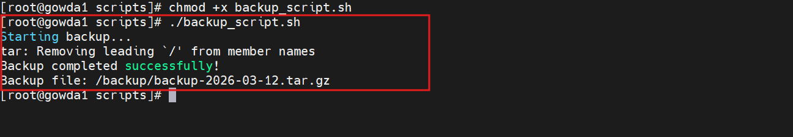

# Backup Automation Script

A simple Bash script to create compressed backups of a directory.

This script is useful for **Linux System Administrators and DevOps Engineers** to automate backups of important files and directories.

---

## 📌 Features

- Creates compressed backups using `tar`
- Automatically adds date to backup filename
- Simple and lightweight Bash script
- Suitable for scheduled backups using cron

---

▶️ How to Run

Give execute permission:

chmod +x backup_script.sh

Run the script:

./backup_script.sh

**Example Output**

Starting backup...

Backup completed successfully!

Backup file: /backup/backup-2026-03-12.tar.gz

 
 # Automate Using Cron

Example: Run backup every day at 2 AM

0 2 * * * /path/to/backup_script.sh

