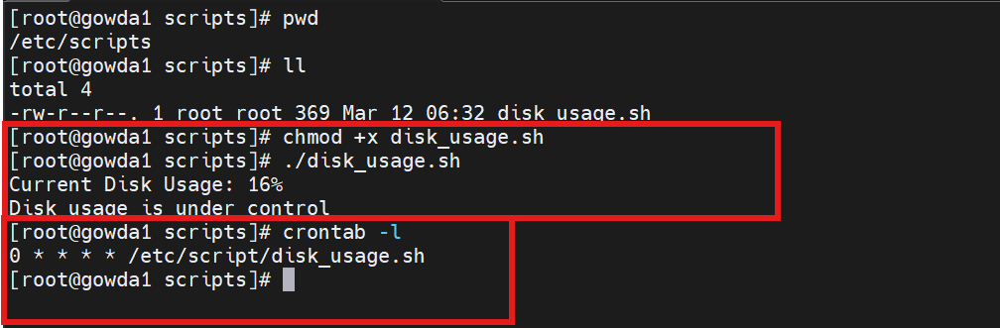

# Disk Usage Monitoring Script

A simple Bash script that checks disk usage of the root (`/`) partition and alerts when usage exceeds a defined threshold.

This script is useful for **Linux System Administrators and DevOps Engineers** to monitor disk usage and prevent storage issues.

---

##  Features

- Checks disk usage of the root partition
- Displays current disk usage percentage
- Warns if disk usage exceeds the defined threshold
- Lightweight and easy to automate

---

# How to Run

Give execute permission:

chmod +x disk_usage.sh

Run the script:

./disk_usage.sh

**📊 Example Output**

Current Disk Usage: 45%
Disk usage is under control

If disk usage is high:

Current Disk Usage: 85%
WARNING: Disk usage is above 80%

# You can run this script automatically using cron.

Example: Run every hour

0 * * * * /path/to/disk_usage.sh
