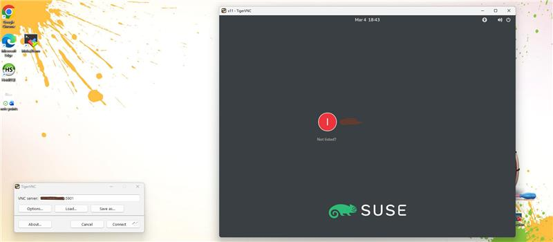

# Linux VNC Automation

Automated TigerVNC + GNOME setup scripts for Enterprise Linux distributions.

This repository provides Bash scripts to configure VNC remote GUI access on:

- Red Hat Enterprise Linux (RHEL)
- SUSE Linux Enterprise Server (SLES)

---

## 🚀 Features

- Installs required VNC and GNOME packages
- Creates Linux user (if not exists)
- Configures secure VNC password
- Sets up GNOME session for VNC
- Enables graphical target
- Configures and starts VNC service
- Production-ready structure (no hardcoded credentials)

---

## 🖥 Supported Operating Systems

### Red Hat Based
- RHEL 8 / 9
- Rocky Linux
- AlmaLinux

### SUSE Based
- SLES 12 / 15

---

# 🔧 How to Execute

## 1️⃣ Clone the Repository

```bash
git clone https://github.com/<your-username>/linux-vnc-automation.git
cd linux-vnc-automation
2️⃣ Make Script Executable

For RHEL:

chmod +x rhel_vnc_auto_setup.sh

For SLES:

chmod +x sles_vnc_auto_setup.sh
3️⃣ Run the Script (as root)

For RHEL:

sudo ./rhel_vnc_auto_setup.sh

For SLES:

sudo ./sles_vnc_auto_setup.sh
🖧 Default VNC Configuration

Display : :1

Port : 5901

Desktop : GNOME

🔍 Verify VNC Service (RHEL)
systemctl status vncserver@:1.service
🔍 Verify VNC Service (SLES)
systemctl status vncmanager
🛠 Example Connection

From your local system:

<server-ip>:5901



Using any VNC Viewer (RealVNC, TigerVNC, etc.)
