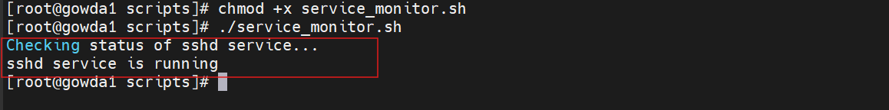

# Service Monitoring Script

A simple Bash script to monitor a Linux service and automatically start it if the service is not running.

This script helps **Linux System Administrators and DevOps Engineers** ensure critical services remain active on servers.

---

## Features

- Checks the status of a Linux service
- Automatically starts the service if it is stopped
- Useful for server monitoring and automation

---
▶️ How to Run

Give execute permission:

chmod +x service_monitor.sh

Run the script:

./service_monitor.sh

**Example Output**

Service running:

Checking status of sshd service...

sshd service is running

# If Service stopped:

Checking status of sshd service...

sshd service is not running

Starting sshd service...

sshd service started successfully

# Automation Using Cron

Example: Run every 5 minutes

*/5 * * * * /path/to/service_monitor.sh
