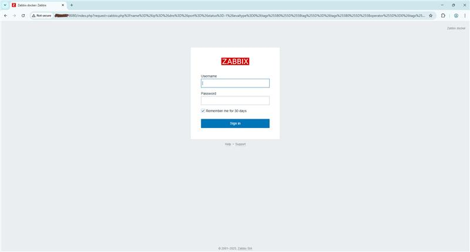

# Zabbix on Docker Setup

Automated deployment of a **Zabbix monitoring environment using Docker containers**.
This script installs and configures the required components including:

* MySQL Database
* Zabbix Server
* Zabbix Web Interface (Nginx + PHP)
* Zabbix Java Gateway
* Zabbix Agent

The entire stack is deployed automatically with a single script.




---

## Overview

This project provides a Bash script that:

* Creates a dedicated Docker network
* Deploys MySQL for the Zabbix backend
* Starts the Zabbix Server container
* Deploys the Zabbix Web UI
* Configures a Zabbix Java Gateway
* Starts a Zabbix Agent container
* Enables container auto-restart

The goal is to quickly spin up a **fully working Zabbix monitoring environment**.

---

## Requirements

Before running the script, ensure the system has:

* Linux Server (RHEL / CentOS / AlmaLinux / SUSE / Ubuntu / Debian)
* Docker installed and running
* Root or sudo privileges
* Internet connectivity to pull Docker images

---

## Installation

Clone the repository:

```
git clone https://github.com/your-username/zabbix-docker-setup.git
```

Navigate to the project directory:

```
cd zabbix-docker-setup
```

Make the script executable:

```
chmod +x zabbix_docker_install.sh
```

Run the installation script:

```
sudo ./zabbix_docker_install.sh
```

---

## Access the Zabbix Web Interface

After the script completes, open the following URL in a browser:

```
http://<server-ip>:8080
```

### Default Login

Username

```
Admin
```

Password

```
zabbix
```

---

## Running Containers

You can verify the containers with:

```
docker ps
```

Expected containers:

* mysql-server
* zabbix-server-mysql
* zabbix-web-nginx-mysql
* zabbix-java-gateway
* zabbix-agent2

---

## Features

* Fully automated Zabbix deployment
* Docker-based environment
* Easy setup and cleanup
* Cross-distribution Linux compatibility
* Quick web interface access

---
