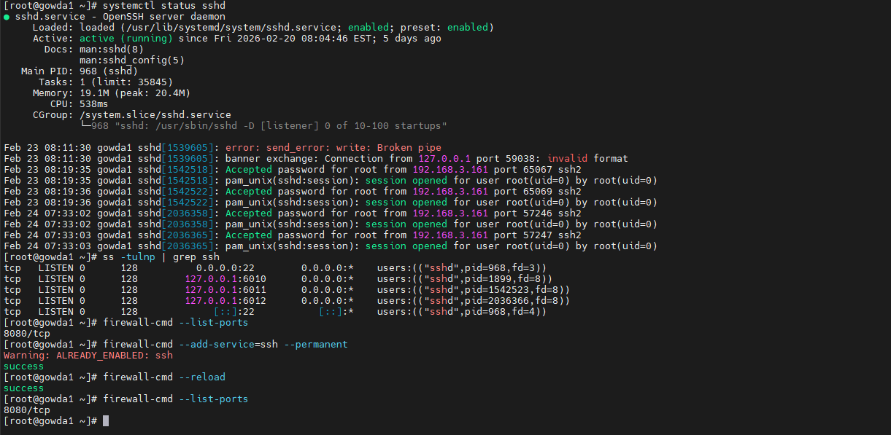

**What is SSH**

SSH (Secure Shell) is used to securely connect to remote Linux servers.

Default Port: 22

**SSH Service Commands**

Check SSH status:

systemctl status sshd

systemctl start sshd

systemctl enable sshd

Check listening port:

ss -tulnp | grep ssh

**Test SSH Connectivity**

ssh user@server-ip

Check port connectivity:

telnet server-ip 22

**Firewall Basics (firewalld)**

Check firewall status:

systemctl status firewalld

List allowed ports:

firewall-cmd --list-ports

**Allow SSH Port**

firewall-cmd --add-service=ssh --permanent

firewall-cmd --reload

**Remove Allowed Port**

firewall-cmd --remove-port=22/tcp --permanent

firewall-cmd --reload

**Troubleshooting SSH Connection Issue**

***Problem: Unable to connect via SSH***

Checks :

ping server-ip

systemctl status sshd

firewall-cmd --list-all

getenforce

**Possible Causes**

SSH service stopped

Firewall blocking port

SELinux restriction

Wrong IP or network issue
