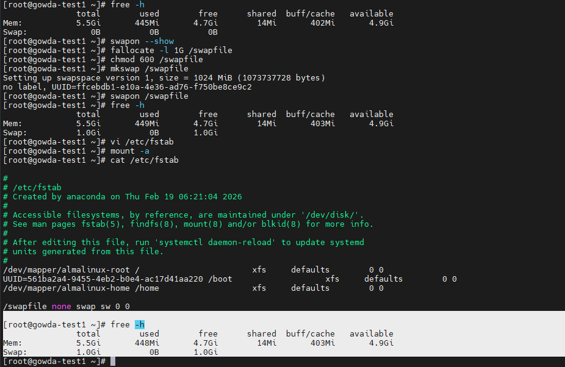

# Linux Swap Memory Management

## What is Swap?
Swap is disk space used as virtual memory when physical RAM becomes full.

Linux moves inactive memory pages from RAM to swap to:
- prevent system crashes
- free RAM for active processes
- maintain system stability

RAM = fast memory  
Swap = slower disk-based memory

------------------------------

## Check Swap Usage ##

Check memory and swap summary:
free -h

Show active swap devices/files:
swapon --show

Check detailed memory statistics:
vmstat 1

**If not Create New Swap File (1GB Example)**

Create swap file
fallocate -l 1G /swapfile

Set secure permission
chmod 600 /swapfile

Format as swap
mkswap /swapfile

Enable swap
swapon /swapfile

Verify
free -h

**Make Swap Persistent (After Reboot)**

Edit fstab:
vi /etc/fstab

Add:
/swapfile none swap sw 0 0

Test without reboot:
mount -a

## 🔹 Swap Memory Verification
Below screenshot shows swap memory configured and active:

***Extend Swap Memory*** Best Option

Disable existing swap:
swapoff /swapfile

Remove old swap:
rm -f /swapfile

***Create again larger swap***As same***

Real Admin Scenario (below Example like)

During a production server slowdown:
Observed high swap usage using **free -h**
Identified memory-heavy processes using **top**
Verified swap activity using **vmstat 1**
Found continuous swap-in/out activity
Extended swap safely and optimized service memory usage

Result:
System performance stabilized without downtime
