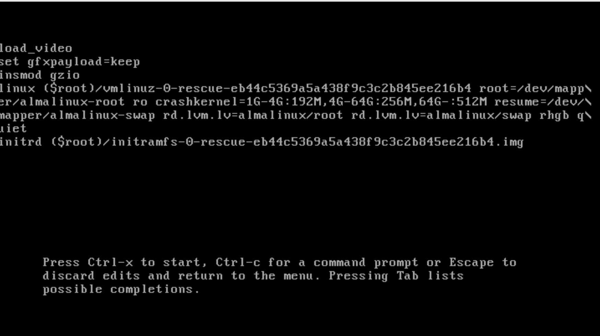
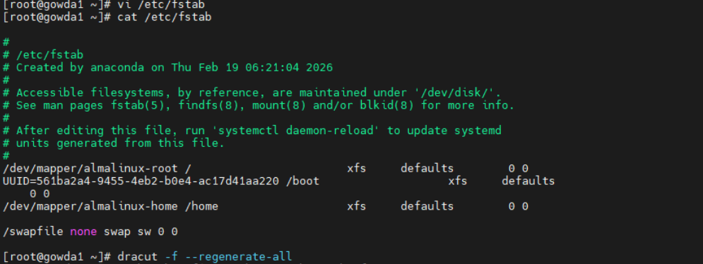
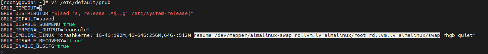
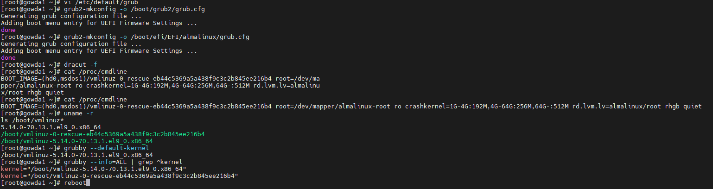

# Dracut Emergency Mode – Missing LVM Swap (AlmaLinux)

## Issue

System boot failed and dropped into:

dracut:/#
Press Control-D to continue

### Error Observed

Failed to find logical volume "almalinux/swap"
Warning: /dev/almalinux/swap does not exist

System entered **dracut emergency mode** during boot.

---

## Temporary Fix (Boot Once)

1. At GRUB menu press `e`
2. Locate the line starting with `linux`

Remove the following parameters:

resume=/dev/mapper/almalinux-swap
rd.lvm.lv=almalinux/swap

4. Boot using:

Ctrl + X

**System boots successfully and SSH access (PuTTY) becomes available.**

---

Checking `/etc/fstab` revealed:

## Root Cause

- System originally used **LVM swap**

/dev/mapper/almalinux-swap

- Swap logical volume was removed.
- A **swapfile** was created instead.
- GRUB kernel parameters still referenced old LVM swap.

Kernel boot parameters contained:

resume=/dev/mapper/almalinux-swap

rd.lvm.lv=almalinux/swap

Dracut attempted to activate a non-existent logical volume → boot failure.

---

## Permanent Fix

### 1. Edit GRUB Defaults

vi /etc/default/grub

Remove these entries from `GRUB_CMDLINE_LINUX`:

resume=/dev/mapper/almalinux-swap

rd.lvm.lv=almalinux/swap

---

### 2. Rebuild GRUB Configuration

grub2-mkconfig -o /boot/grub2/grub.cfg

grub2-mkconfig -o /boot/efi/EFI/almalinux/grub.cfg

---

### 3. Rebuild Initramfs

dracut -f

---

### 4. Verify Boot Parameters

cat /proc/cmdline

Ensure **no swap LV references** exist.

---

## Verification

swapon --show
uname -r

Result:

✅ System boots normally  
✅ No dracut emergency shell  
✅ Swapfile active

---

## Lessons Learned

- Always update GRUB after LVM or storage changes.
- `/etc/fstab` and kernel parameters must match.
- Most dracut failures are caused by missing root or swap devices.

---

## Environment

- OS: AlmaLinux 9
- Storage: LVM
- Swap Type: swapfile
