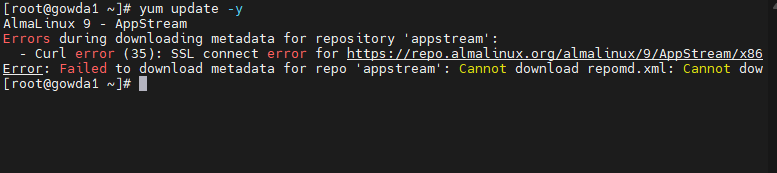
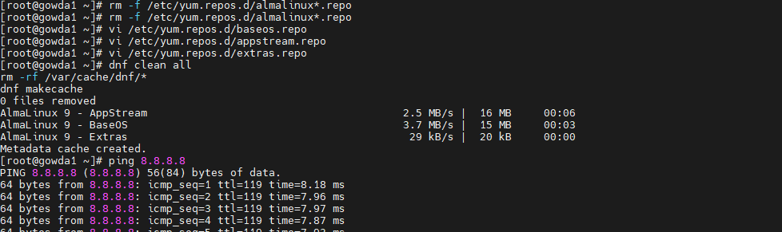
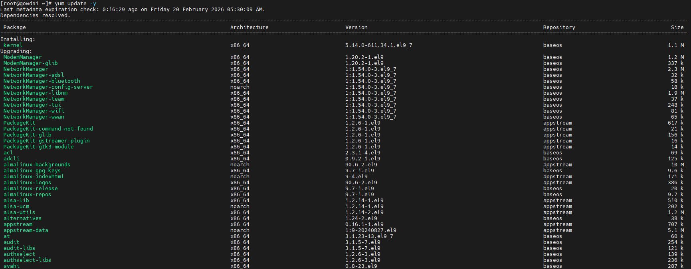

# DNF SSL Connection Reset – AlmaLinux 9 Repository Fix
Issue

While installing packages using dnf, repositories failed with SSL errors:

**Commands Affected**

dnf install services

dnf update

dnf makecache

Symptoms

✅ Internet connectivity working

✅ DNS resolution working

✅ HTTPS working for other sites

**❌ AlmaLinux repositories unreachable**

# Verification

ping 8.8.8.8              ✅ OK

curl https://google.com   ✅ OK

dnf makecache             ❌ FAILED

Error observed:

Cannot download repomd.xml

SSL_connect: Connection reset by peer

Root Cause

**The system could not complete the TLS handshake with AlmaLinux CDN mirrors.**

**Possible reasons:**

Network firewall inspection

CDN TLS incompatibility

IPv6/CDN routing issues

Corporate or VM network filtering

dnf mirrorlist used HTTPS CDN endpoints which reset the connection during SSL negotiation.

****Solution (Working Fix)****

Bypass CDN mirrorlist and configure direct HTTP mirrors.

**Remove Existing Repository Files**

rm -f /etc/yum.repos.d/almalinux*.repo

**Configure BaseOS Repository**

vi /etc/yum.repos.d/baseos.repo

[baseos]

name=AlmaLinux 9 - BaseOS

baseurl=http://mirror.alwyzon.net/almalinux/9/BaseOS/x86_64/os/

enabled=1

gpgcheck=0

**Configure AppStream Repository**

vi /etc/yum.repos.d/appstream.repo

[appstream]

name=AlmaLinux 9 - AppStream

baseurl=http://mirror.alwyzon.net/almalinux/9/AppStream/x86_64/os/

enabled=1

gpgcheck=0

**Configure Extras Repository**

vi /etc/yum.repos.d/extras.repo

[extras]

name=AlmaLinux 9 - Extras

baseurl=http://mirror.alwyzon.net/almalinux/9/extras/x86_64/os/

enabled=1

gpgcheck=0

**Rebuild DNF Cache**

dnf clean all

rm -rf /var/cache/dnf/*

dnf makecache

Metadata cache created....

**Install Package (Verification)**

yum update -y

✅ update successful.

# Observations

Network connectivity ≠ repository connectivity

CDN TLS failures can break package managers

Direct mirrors help isolate SSL/CDN problems

Always troubleshoot layer-by-layer:

Network → DNS → HTTPS → Repository
