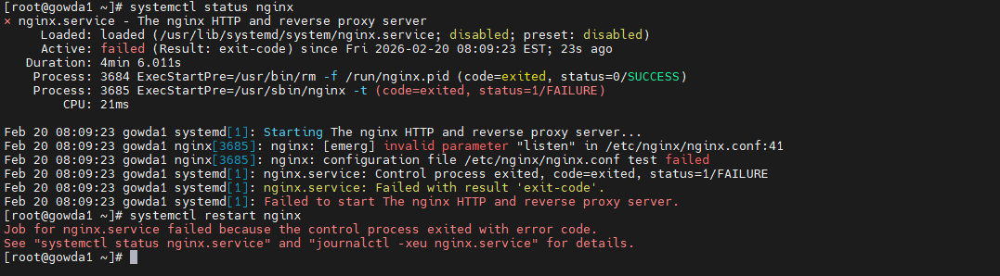
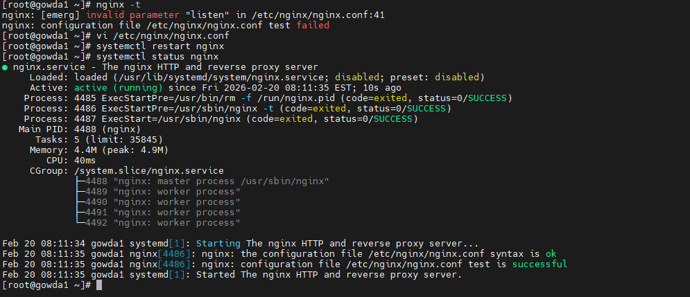

**Log Analysis (journalctl & /var/log)**

**1️⃣ What is Log Analysis**

Log analysis helps identify system, service, and application issues using system-generated logs.
It is one of the primary troubleshooting methods used by Linux administrators.

**2️⃣ Log Locations**

**Most Linux logs are stored in:** ls -lh /var/log/

**Common log files:**

**/var/log/messages**   → General system logs

**/var/log/secure**     → Authentication & SSH logs

**/var/log/syslog**   → System activity (Debian/Ubuntu)

**/var/log/dmesg**     → Kernel boot messages

**3️⃣ journalctl Commands**

(Used to troubleshoot service failures, boot problems, and system errors)

View all logs **journalctl**

Recent errors (most commonly used) **journalctl -xe**

Logs for specific service **journalctl -u nginx**

Follow logs in real time **journalctl -f**

Logs from current boot **journalctl -b**

Logs from last hour **journalctl --since "1 hour ago"**

**4️⃣ Traditional Log Monitoring**

Monitor logs live **tail -f /var/log/messages**

Search for errors **grep -i error /var/log/messages**

Read authentication logs **less /var/log/secure**

**Example: Nginx service not able to start**

**5️⃣ Troubleshooting Workflow**

Check service status **systemctl status nginx**

Validate configuration **nginx -t**

Check system errors **journalctl -xe**

Check service logs  **journalctl -u nginx**

Monitor system logs   **tail -f /var/log/messages**

**The error shown above indicates a syntax error in the nginx configuration file.

Based on the log output, the incorrect configuration must be corrected in the config file before starting the service.**

**After correcting configuration:**

syntax is ok

test is successful

can start the service

**6️⃣ Real Scenario**

Example:

A service failed to start after configuration changes.
Using systemctl status and journalctl -xe, I identified a permission error in the configuration file. After correcting file ownership and validating using nginx -t, the service started successfully.
